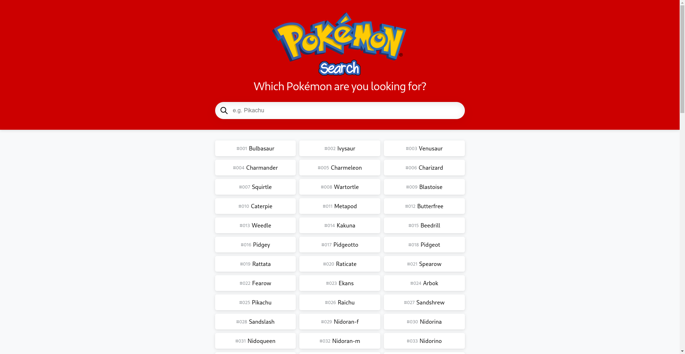
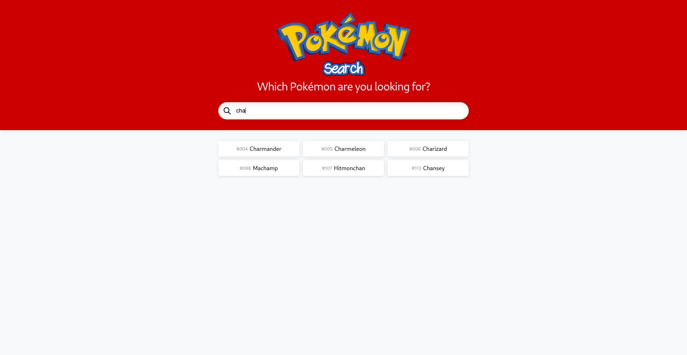
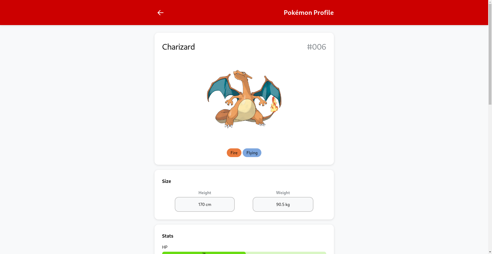
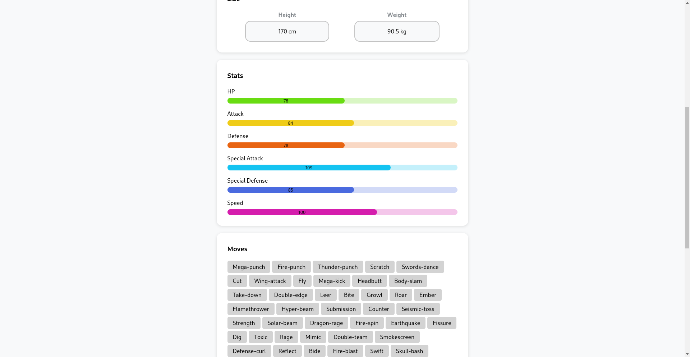

# Pokémon Search

## About

Pokémon Search is a React based app built to practice and enhance my coding skills in React.js and get familiar with Vite. It leverages the PokéAPI to fetch and display information about various 1st gen Pokémon.

## Live Version

Available at: https://kaklewski.github.io/pokemon-search/

## Features

-   **Pokémon List**: Browse through a list of Pokémon fetched from the PokéAPI.
-   **Search Functionality**: Search for specific Pokémon by name.
-   **Save Bandwidth**: All fetched Pokémon data is kept in Local Storage and Pokémon profile data is kept in te Session Storage.
-   **Detailed View**: Click on a Pokémon to view detailed information including its stats, moves, size and types.
-   **Responsive Design**: The app is designed to be fully responsive, providing a seamless experience on both desktop and mobile devices.

## Screenshots

## Run Locally

1. Clone the project to your local machine:

`git clone https://github.com/kaklewski/pokemon-search`

2. Navigate to the project directory:

`cd pokemon-search`

3. Install the dependencies:

`npm install`

4. Start the development server:

`npm run dev`

## Build with Vite

1. Build the dist:

`npm run build`

2. Preview the build:

`npm run preview`
